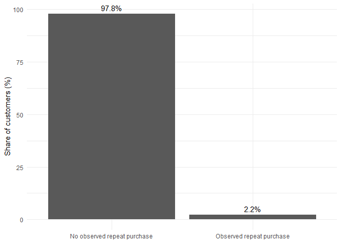
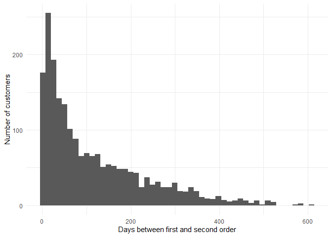
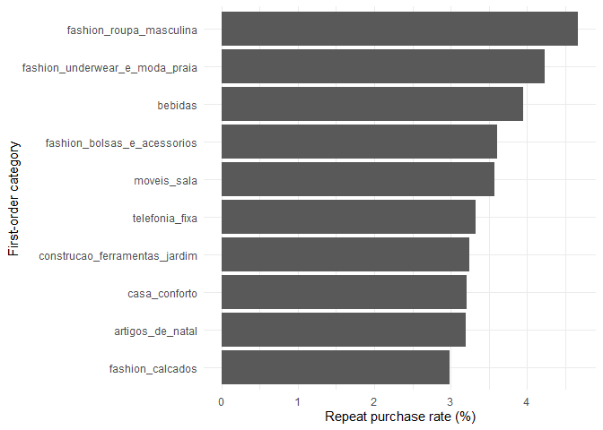

# Customer Purchase Behavior Analysis
Eetu Tammi

## Introduction

This project analyzes customer purchasing behavior using the Olist
Brazilian E-Commerce Public Dataset.

The analysis focuses on customer retention, purchasing behavior, and
customer value, with the aim of understanding why some customers return
and why some customers generate substantially more revenue than others.

The first research question is:

**How common are repeat purchases, and what characteristics of the first
purchase are associated with customers returning?**

The analysis examines the frequency of repeat purchases, the time
between the first and second order, differences between repeat and
non-repeat customers, the relationship between first-order product
categories and repeat purchasing, and whether repeat purchases can be
predicted using information available from the first order.

The second research question is:

**Which customers are most valuable, and can high-value customers be
identified using information from their first purchase?**

The analysis examines the distribution of customer spending, the
concentration of revenue among high-value customers, differences in
customer value across first-order categories, and whether high-value
customers can be identified using characteristics of their first
purchase.

The third research question is:

**How is delivery performance associated with customer satisfaction and
repeat purchasing?**

The analysis examines whether late deliveries are associated with lower
review scores and lower repeat-purchase rates.

## Data

The analysis uses five datasets from the Olist e-commerce dataset:

- orders
- customers
- order items
- products
- reviews

The analysis focuses on customer orders, repeat purchasing, first-order
characteristics, product categories, delivery experience, and customer
reviews.

## Data Preparation

The analysis uses `customer_unique_id` as the customer identifier. The
`customer_id` in the orders data identifies a customer record, so orders
are linked to the customer data and grouped using `customer_unique_id`
to identify individual customers across orders.

Orders are sorted by purchase timestamp for each customer, allowing the
first and second orders to be identified. A repeat purchase is defined
as a second order occurring at least one day after the first order.
Customers without a qualifying second order are classified as non-repeat
customers.

For the first order, additional characteristics are collected, including
order value, number of items, freight value, delivery time, product
category, and review score. These variables are used to compare repeat
and non-repeat customers and to evaluate whether repeat purchases can be
predicted from information available at the first purchase.

Delivery performance is also included in the first-order data. Delivery
time and whether the order was delivered later than the estimated
delivery date are used to examine the relationship between delivery
performance, customer satisfaction, and repeat purchasing.

In addition, all orders are aggregated at the customer level to measure
customer value. Total spending, number of orders, number of items,
average order value, and other customer-level measures are calculated.
Customers in the top 10% of total spending are classified as high-value
customers. These measures are then used to examine revenue concentration
and whether high-value customers can be identified from characteristics
of their first purchase.

## Research Question 1: Repeat Purchases

### Question

**How common are repeat purchases, what characteristics are associated
with customers returning, and can repeat purchases be predicted from
information available at the first purchase?**

The aim of this part of the analysis is to understand customer retention
and identify patterns associated with repeat purchasing. The analysis
first examines how common repeat purchases are and how long customers
typically take to place a second order.

The analysis then compares repeat and non-repeat customers based on
characteristics of their first purchase, including order value, number
of items, freight value, delivery time, product category, and review
score. Finally, a logistic regression model is used to evaluate whether
repeat purchases can be predicted using information available from the
first order.

### How common are repeat purchases?

The analysis identified 96,096 unique customers. Of these, 2,070
customers made an observed repeat purchase, corresponding to a repeat
purchase rate of approximately 2.2%.

Figure 1: Observed repeat purchase among unique customers.

The result shows that repeat purchasing is relatively uncommon in the
observed data. Approximately **97.8%** of customers did not have an
observed second purchase, while only **2.2%** made a qualifying repeat
purchase.

This result should be interpreted with some caution. The dataset covers
a limited observation period, meaning that customers who made their
first purchase near the end of the period may not have had enough time
to return. Therefore, the observed repeat purchase rate should not be
interpreted as a complete measure of long-term customer retention.

### How long does it take customers to return?

Among customers who made a qualifying second purchase, the median time
between the first and second order was **74.8 days**. The mean was
considerably higher at **116.3 days**, indicating **a right-skewed
distribution**.

The shortest observed interval was approximately one day, while the
longest was approximately 609 days.

Figure 2: Distribution of the time between the first and second order.

The difference between the median and mean suggests that most returning
customers purchase again relatively soon, while a smaller number return
much later. The median of approximately 75 days therefore provides a
more representative measure of typical repeat purchase timing than the
mean.

### Do first-order characteristics differ between customer groups?

The next step compares the first orders of customers who did and did not
make a repeat purchase.

    # A tibble: 2 × 13
      repeat_purchase customers median_order_value mean_order_value median_items
                <dbl>     <int>              <dbl>            <dbl>        <dbl>
    1               0     94319               86.9             138.            1
    2               1      2074               85.1             129.            1
    # ℹ 8 more variables: mean_items <dbl>, median_freight <dbl>,
    #   mean_freight <dbl>, median_delivery_days <dbl>, mean_delivery_days <dbl>,
    #   median_review_score <dbl>, mean_review_score <dbl>,
    #   late_delivery_rate <dbl>

The descriptive comparison shows relatively small differences in
first-order value between the two groups. The median order value was
approximately 86.9€ among customers without an observed repeat purchase
and **85.1€** among repeat customers. Mean order value was also slightly
lower among repeat customers (**129€ compared with 138€**).

A more noticeable difference was found in the number of items purchased.
The mean number of items was 1.14 among customers without a repeat
purchase and 1.21 among repeat customers.

This suggests that customers purchasing several items in their first
order may be somewhat more likely to return, although the difference
alone does not establish a causal relationship.

### Does the first product category matter?

The first-order product category was also examined. To avoid unstable
estimates based on very small customer groups, categories with fewer
than 100 customers were excluded from the descriptive comparison.

Figure 3: Repeat purchase rate by first-order product category.
Categories with fewer than 100 customers are excluded.

There are clear differences in observed repeat purchase rates between
product categories. Among categories with at least 100 customers, the
highest observed rates included men’s fashion (4.67%), fashion underwear
and beachwear (4.24%), beverages (3.96%), and fashion bags and
accessories (3.61%).

However, the smallest categories also have relatively few repeat
customers, so individual percentages should not be overinterpreted.

A Pearson chi-squared test with a simulated p-value was used because the
category data contain many groups with relatively small counts.

        Pearson's Chi-squared test with simulated p-value (based on 10000
        replicates)

    data:  table(first_order_analysis$first_order_category, first_order_analysis$repeat_purchase)
    X-squared = 158.86, df = NA, p-value = 3e-04

The test produced **a simulated p-value below 0.001**, indicating that
the distribution of repeat purchases differs across first-order
categories. This provides evidence of an association between the
category of the first purchase and subsequent repeat purchasing.

The result does not, however, mean that purchasing a particular category
causes customers to return. Category differences may reflect other
characteristics of the products or customers.

### Can repeat purchases be predicted from the first order?

To examine whether repeat purchases can be predicted using information
available from the first order, a logistic regression model was
estimated.

The model included:

- first-order value
- number of items
- freight value
- first-order product category

The data were divided into training and test sets, with 80% of
observations used for training and 20% for testing.

    Call:
    glm(formula = repeat_purchase ~ order_value + number_of_items + 
        freight_value + first_order_category, family = binomial, 
        data = train_data)

    Coefficients:
                                                                         Estimate Std. Error z value Pr(>|z|)    
    (Intercept)                                                        -4.401e+00  7.141e-01  -6.163 7.15e-10 ***
    order_value                                                        -5.705e-05  1.453e-04  -0.393    0.694    
    number_of_items                                                     1.856e-01  3.989e-02   4.652 3.29e-06 ***
    freight_value                                                      -2.242e-03  1.638e-03  -1.369    0.171    
    first_order_categoryalimentos                                      -2.240e-01  8.726e-01  -0.257    0.797    
    first_order_categoryalimentos_bebidas                              -1.880e-01  1.007e+00  -0.187    0.852    
    first_order_categoryartes                                          -1.086e-01  1.007e+00  -0.108    0.914    
    first_order_categoryartigos_de_natal                                1.083e+00  8.771e-01   1.234    0.217    
    first_order_categoryaudio                                           5.949e-01  8.089e-01   0.735    0.462    
    first_order_categoryautomotivo                                      2.913e-01  7.250e-01   0.402    0.688    
    first_order_categorybebes                                           1.060e-01  7.327e-01   0.145    0.885    
    first_order_categorybebidas                                         7.956e-01  8.101e-01   0.982    0.326    
    first_order_categorybeleza_saude                                    3.030e-01  7.181e-01   0.422    0.673    
    first_order_categorybrinquedos                                      1.772e-01  7.268e-01   0.244    0.807    
    first_order_categorycama_mesa_banho                                 6.456e-01  7.165e-01   0.901    0.368    
    first_order_categorycasa_conforto                                   6.275e-01  8.090e-01   0.776    0.438    
    first_order_categorycasa_construcao                                 5.508e-01  7.885e-01   0.699    0.485    
    first_order_categoryclimatizacao                                    4.534e-01  8.735e-01   0.519    0.604    
    first_order_categoryconsoles_games                                  9.504e-02  7.655e-01   0.124    0.901    
    first_order_categoryconstrucao_ferramentas_construcao              -1.715e-01  8.077e-01  -0.212    0.832    
    first_order_categoryconstrucao_ferramentas_iluminacao              -2.656e-01  1.007e+00  -0.264    0.792    
    first_order_categoryconstrucao_ferramentas_jardim                   8.958e-01  8.458e-01   1.059    0.290    
    first_order_categoryconstrucao_ferramentas_seguranca               -5.718e-01  1.231e+00  -0.464    0.642    
    first_order_categorycool_stuff                                      8.478e-02  7.292e-01   0.116    0.907    
    first_order_categoryeletrodomesticos                                3.005e-01  7.810e-01   0.385    0.700    
    first_order_categoryeletrodomesticos_2                             -8.814e-01  1.230e+00  -0.717    0.474    
    first_order_categoryeletronicos                                     6.117e-02  7.365e-01   0.083    0.934    
    first_order_categoryeletroportateis                                -1.241e-01  8.221e-01  -0.151    0.880    
    first_order_categoryesporte_lazer                                   6.429e-01  7.173e-01   0.896    0.370    
    first_order_categoryfashion_bolsas_e_acessorios                     9.830e-01  7.269e-01   1.352    0.176    
    first_order_categoryfashion_calcados                                8.962e-01  8.251e-01   1.086    0.277    
    first_order_categoryfashion_roupa_masculina                         1.417e+00  8.488e-01   1.670    0.095 .  
    first_order_categoryfashion_underwear_e_moda_praia                  1.178e+00  8.777e-01   1.342    0.180    
    first_order_categoryferramentas_jardim                              5.631e-01  7.231e-01   0.779    0.436    
    first_order_categoryindustria_comercio_e_negocios                   1.788e-01  9.203e-01   0.194    0.846    
    first_order_categoryinformatica_acessorios                          1.877e-01  7.206e-01   0.260    0.795    
    first_order_categoryinstrumentos_musicais                           4.796e-02  8.075e-01   0.059    0.953    
    first_order_categorylivros_interesse_geral                          4.589e-01  7.886e-01   0.582    0.561    
    first_order_categorylivros_tecnicos                                -1.120e+00  1.230e+00  -0.910    0.363    
    first_order_categorymalas_acessorios                                1.435e-01  7.656e-01   0.187    0.851    
    first_order_categorymarket_place                                    3.200e-01  8.735e-01   0.366    0.714    
    first_order_categorymoveis_cozinha_area_de_servico_jantar_e_jardim -2.334e-01  1.007e+00  -0.232    0.817    
    first_order_categorymoveis_decoracao                                6.799e-01  7.181e-01   0.947    0.344    
    first_order_categorymoveis_escritorio                               1.722e-01  7.567e-01   0.228    0.820    
    first_order_categorymoveis_sala                                     1.111e+00  7.673e-01   1.448    0.148    
    first_order_categoryother                                           4.023e-01  7.323e-01   0.549    0.583    
    first_order_categorypapelaria                                       2.859e-01  7.336e-01   0.390    0.697    
    first_order_categorypcs                                            -1.119e+01  1.225e+02  -0.091    0.927    
    first_order_categoryperfumaria                                      5.226e-01  7.250e-01   0.721    0.471    
    first_order_categorypet_shop                                        5.837e-01  7.342e-01   0.795    0.427    
    first_order_categoryrelogios_presentes                              1.539e-01  7.225e-01   0.213    0.831    
    first_order_categorysinalizacao_e_seguranca                         2.683e-01  1.009e+00   0.266    0.790    
    first_order_categorytelefonia                                       3.590e-01  7.236e-01   0.496    0.620    
    first_order_categorytelefonia_fixa                                  1.062e+00  8.100e-01   1.311    0.190    
    first_order_categoryutilidades_domesticas                           3.660e-01  7.206e-01   0.508    0.612    
    ---
    Signif. codes:  0 '***' 0.001 '**' 0.01 '*' 0.05 '.' 0.1 ' ' 1

    (Dispersion parameter for binomial family taken to be 1)

        Null deviance: 15674  on 76545  degrees of freedom
    Residual deviance: 15530  on 76491  degrees of freedom
    AIC: 15640

    Number of Fisher Scoring iterations: 14

The number of items in the first order was the clearest continuous
predictor in the model. Its coefficient was positive and **statistically
significant (p \< 0.001)**. This indicates that customers who purchased
more items in their first order tended to have higher odds of making a
repeat purchase.

Order value and freight value were not statistically significant
predictors in the model.

Although the category-level coefficients varied, most individual
category effects were not statistically significant. This is consistent
with the large number of categories and relatively small number of
repeat purchases.

### How well can repeat purchases be predicted?

The model was evaluated using the test data and the area under the ROC
curve (AUC).

    Area under the curve: 0.5458

The resulting AUC was **0.546**.

An AUC of 0.5 corresponds to random classification. Therefore, the
model’s performance is only slightly better than random prediction.

This is an important finding. Although some variables are statistically
associated with repeat purchasing, the available first-order information
does not provide strong enough predictive power to reliably identify
which individual customers will return.

### Findings

Overall, the analysis produces four main findings.

1.  **Repeat purchasing is relatively uncommon.** Only approximately
    2.2% of unique customers made an observed second purchase at least
    one day after their first order.

2.  **Returning customers typically return after several weeks.** The
    median time to a second order was approximately 75 days, although
    some customers returned substantially later.

3.  **Product category is associated with repeat purchasing.** The
    chi-squared test indicates statistically significant differences in
    repeat purchasing across first-order categories. However, small
    category sizes mean that individual category percentages should be
    interpreted cautiously.

4.  **Predicting individual repeat purchases is difficult.** The number
    of items in the first order was positively associated with repeat
    purchasing, but the logistic regression model achieved an AUC of
    only 0.546 on unseen data. This suggests that the variables
    available from the first purchase are not sufficient for accurate
    individual-level prediction.

Taken together, the results suggest that customer retention is a
potential business opportunity, but the available transaction-level
variables do not provide a strong basis for predicting individual repeat
customers. The next analysis can therefore focus on understanding
**customer value and which customer segments represent the greatest
retention opportunity**.

## Research Question 2: Customer Value

### Question

**Which customers are most valuable, and can high-value customers be
identified using information from their first purchase?**

The previous analysis focused on whether a customer makes another
purchase. However, repeat purchasing alone does not describe the
economic value of a customer. A customer who makes several small
purchases may generate less revenue than a customer who makes fewer but
substantially larger purchases.

Therefore, this part of the analysis focuses on customer value.
Customers are classified as high-value customers if their total spending
is in the top 10% of the customer distribution. The analysis then
examines how customer value is distributed and whether high-value
customers can be identified using information available from their first
purchase.

### Customer Value

Customer value is calculated by aggregating all orders belonging to the
same `customer_unique_id`. For each customer, total spending, total
freight costs, number of orders, number of items, and average order
value are calculated.

    # A tibble: 2 × 6
      high_value_customer customers median_total_spend mean_total_spend median_number_of_orders mean_number_of_orders
      <lgl>                   <int>              <dbl>            <dbl>                   <dbl>                 <dbl>
    1 FALSE                   86753                 79             92.3                       1                  1.03
    2 TRUE                     9640                420            586.                        1                  1.12

The results show a clear difference between high-value and other
customers. The median total spending among high-value customers is
**420€**, compared with **78.90€** among other customers. High-value
customers also place slightly more orders on average.

### Revenue Concentration

High-value customers represent only **10% of the customer base**, but
they account for **41.4% of total customer spending**.

    # A tibble: 1 × 4
      high_value_customers total_customers high_value_share high_value_revenue_share
                     <int>           <int>            <dbl>                    <dbl>
    1                 9640           96393             10.0                     41.4

This indicates that customer value is highly concentrated. A relatively
small proportion of customers generates a disproportionately large share
of total revenue.

### Distribution of Customer Spending

The distribution of total customer spending is strongly right-skewed.
Most customers spend relatively small amounts, while a small number of
customers have substantially higher total spending.

The high concentration of spending supports the use of a high-value
customer segment rather than relying only on average customer spending.

### High-Value Customers by First-Order Category

The first-order category is also compared across high-value and other
customers.

    # A tibble: 15 × 5
       first_order_category                           customers high_value_customers high_value_rate median_total_spend
       <chr>                                              <int>                <int>           <dbl>              <dbl>
     1 pcs                                                  176                  175            99.4             1200  
     2 agro_industria_e_comercio                            178                   93            52.2              391. 
     3 eletrodomesticos_2                                   225                  104            46.2              230. 
     4 instrumentos_musicais                                612                  184            30.1              127. 
     5 construcao_ferramentas_seguranca                     158                   46            29.1              140. 
     6 eletroportateis                                      616                  179            29.1              109  
     7 moveis_cozinha_area_de_servico_jantar_e_jardim       238                   54            22.7              130. 
     8 climatizacao                                         242                   54            22.3              139  
     9 construcao_ferramentas_construcao                    720                  143            19.9              100.0
    10 moveis_escritorio                                   1239                  233            18.8              170. 
    11 casa_construcao                                      463                   83            17.9              120. 
    12 relogios_presentes                                  5431                  972            17.9              144  
    13 consoles_games                                      1041                  180            17.3               69.9
    14 moveis_sala                                          391                   64            16.4              115. 
    15 construcao_ferramentas_iluminacao                    229                   36            15.7              169  

The high-value rate varies substantially across first-order product
categories. Among categories with at least 100 customers, **pcs** has by
far the highest high-value rate at **99.4%**, although this category
contains only 176 customers. The next highest rates are observed for
**agro_industria_e_comercio (52.2%)** and **eletrodomesticos_2
(46.2%)**.

Other categories with relatively high high-value rates include
**instrumentos_musicais (30.1%)**, **construcao_ferramentas_seguranca
(29.1%)**, and **eletroportateis (29.1%)**. In contrast, larger
categories such as **relogios_presentes**, with 5,431 customers, have a
more moderate high-value rate of **17.9%**.

The results suggest that the product category of the first purchase may
be associated with subsequent customer value. However, the highest rates
in some categories are based on relatively small customer groups, so
these results should be interpreted with caution.

### Predicting High-Value Customers

The next step is to test whether high-value customers can be identified
using information available from their first purchase.

A logistic regression model is used with high-value customer status as
the outcome. The predictors describe the first purchase:

- order value

- number of items

- freight value

- delivery time

- review score

- first-order product category

The model is evaluated on a separate test set using ROC-AUC.

    Call:
    glm(formula = high_value_customer ~ order_value + number_of_items + 
        freight_value + delivery_days + review_score + first_order_category, 
        family = binomial, data = train_data_value)

    Coefficients:
                                                                         Estimate Std. Error z value Pr(>|z|)    
    (Intercept)                                                        -1.084e+01  6.681e-01 -16.229   <2e-16 ***
    order_value                                                         3.614e-02  4.901e-04  73.742   <2e-16 ***
    number_of_items                                                     2.468e-02  4.393e-02   0.562   0.5743    
    freight_value                                                      -2.978e-03  1.309e-03  -2.276   0.0229 *  
    delivery_days                                                      -2.143e-03  3.053e-03  -0.702   0.4827    
    review_score                                                       -2.425e-03  2.198e-02  -0.110   0.9121    
    first_order_categoryalimentos                                       1.003e+00  9.949e-01   1.008   0.3133    
    first_order_categoryalimentos_bebidas                               9.754e-01  1.221e+00   0.799   0.4245    
    first_order_categoryartes                                           1.216e-01  1.366e+00   0.089   0.9291    
    first_order_categoryartigos_de_natal                                4.328e-01  1.407e+00   0.308   0.7583    
    first_order_categoryaudio                                          -9.681e-01  1.104e+00  -0.877   0.3805    
    first_order_categoryautomotivo                                      7.296e-01  6.539e-01   1.116   0.2645    
    first_order_categorybebes                                           4.172e-01  6.653e-01   0.627   0.5307    
    first_order_categorybebidas                                        -1.813e+00  2.655e+00  -0.683   0.4948    
    first_order_categorybeleza_saude                                    1.157e+00  6.458e-01   1.792   0.0731 .  
    first_order_categorybrinquedos                                      6.957e-01  6.529e-01   1.066   0.2866    
    first_order_categorycama_mesa_banho                                 1.172e+00  6.458e-01   1.815   0.0695 .  
    first_order_categorycasa_conforto                                   3.836e-01  7.202e-01   0.533   0.5943    
    first_order_categorycasa_construcao                                 1.298e+00  7.231e-01   1.795   0.0727 .  
    first_order_categoryclimatizacao                                    1.422e+00  7.522e-01   1.890   0.0588 .  
    first_order_categoryconsoles_games                                  1.218e+00  6.992e-01   1.742   0.0815 .  
    first_order_categoryconstrucao_ferramentas_construcao               1.138e+00  6.984e-01   1.630   0.1032    
    first_order_categoryconstrucao_ferramentas_iluminacao               4.737e-01  7.274e-01   0.651   0.5149    
    first_order_categoryconstrucao_ferramentas_jardim                  -5.433e-01  1.363e+00  -0.398   0.6903    
    first_order_categoryconstrucao_ferramentas_seguranca                1.422e+00  8.258e-01   1.722   0.0851 .  
    first_order_categorycool_stuff                                      1.064e-01  6.537e-01   0.163   0.8707    
    first_order_categoryeletrodomesticos                                1.297e+00  7.949e-01   1.632   0.1028    
    first_order_categoryeletrodomesticos_2                             -4.797e-01  9.305e-01  -0.516   0.6062    
    first_order_categoryeletronicos                                     6.460e-01  7.121e-01   0.907   0.3643    
    first_order_categoryeletroportateis                                 1.474e+00  7.157e-01   2.059   0.0395 *  
    first_order_categoryesporte_lazer                                   8.623e-01  6.463e-01   1.334   0.1821    
    first_order_categoryfashion_bolsas_e_acessorios                     7.773e-01  6.990e-01   1.112   0.2661    
    first_order_categoryfashion_calcados                                2.051e+00  7.980e-01   2.570   0.0102 *  
    first_order_categoryfashion_roupa_masculina                         1.037e+00  1.080e+00   0.960   0.3372    
    first_order_categoryfashion_underwear_e_moda_praia                  1.948e+00  1.205e+00   1.616   0.1061    
    first_order_categoryferramentas_jardim                              9.971e-01  6.601e-01   1.511   0.1309    
    first_order_categoryindustria_comercio_e_negocios                   5.248e-01  9.974e-01   0.526   0.5988    
    first_order_categoryinformatica_acessorios                          8.835e-01  6.479e-01   1.364   0.1726    
    first_order_categoryinstrumentos_musicais                           5.745e-01  6.991e-01   0.822   0.4112    
    first_order_categorylivros_interesse_geral                          9.702e-01  1.016e+00   0.955   0.3395    
    first_order_categorylivros_tecnicos                                -1.232e+00  1.180e+00  -1.044   0.2963    
    first_order_categorymalas_acessorios                                6.407e-01  6.699e-01   0.956   0.3389    
    first_order_categorymarket_place                                    7.752e-01  8.171e-01   0.949   0.3427    
    first_order_categorymoveis_cozinha_area_de_servico_jantar_e_jardim  1.081e+00  7.953e-01   1.359   0.1741    
    first_order_categorymoveis_decoracao                                1.170e+00  6.465e-01   1.809   0.0704 .  
    first_order_categorymoveis_escritorio                               6.568e-01  6.611e-01   0.994   0.3205    
    first_order_categorymoveis_sala                                     1.488e+00  7.483e-01   1.989   0.0467 *  
    first_order_categoryother                                           8.423e-01  7.116e-01   1.184   0.2366    
    first_order_categorypapelaria                                       8.434e-01  6.824e-01   1.236   0.2165    
    first_order_categorypcs                                             1.343e+00  4.436e+01   0.030   0.9759    
    first_order_categoryperfumaria                                      8.135e-01  6.509e-01   1.250   0.2113    
    first_order_categorypet_shop                                        9.856e-01  6.760e-01   1.458   0.1449    
    first_order_categoryrelogios_presentes                              3.052e-01  6.466e-01   0.472   0.6369    
    first_order_categorysinalizacao_e_seguranca                         1.050e+00  9.826e-01   1.069   0.2851    
    first_order_categorytelefonia                                       8.493e-01  6.580e-01   1.291   0.1968    
    first_order_categorytelefonia_fixa                                  5.110e-01  8.943e-01   0.571   0.5677    
    first_order_categoryutilidades_domesticas                           6.549e-01  6.523e-01   1.004   0.3154    
    ---
    Signif. codes:  0 '***' 0.001 '**' 0.01 '*' 0.05 '.' 0.1 ' ' 1

    (Dispersion parameter for binomial family taken to be 1)

        Null deviance: 48418.7  on 73751  degrees of freedom
    Residual deviance:  9148.4  on 73695  degrees of freedom
    AIC: 9262.4

    Number of Fisher Scoring iterations: 14

The strongest predictor is the value of the first order. The coefficient
for order_value is positive and highly statistically significant,
indicating that customers with larger first purchases are substantially
more likely to belong to the high-value customer group.

Most individual product categories are not statistically significant
after controlling for the other first-order characteristics.

### Model Performance

The model achieves a ROC-AUC of **0.98** on the test data.

    [1] 0.9780744

An AUC of approximately 0.98 indicates excellent discrimination between
high-value and other customers in the test data.

However, the very high AUC should be interpreted with care. High-value
status is defined using customers’ total spending, while first-order
value is included as a predictor. Therefore, a large first purchase
naturally provides strong information about whether the customer’s
eventual total spending will be high.

The result should therefore not be interpreted as evidence that
high-value customers can be identified perfectly from general behavioral
characteristics. Instead, it shows that **initial purchase value is a
very strong indicator of eventual customer value in this dataset**.

### Conclusion

The analysis shows a strong concentration of customer value in the Olist
data. The top 10% of customers account for **41.4% of total spending**,
while their median spending is substantially higher than that of other
customers.

The predictive analysis also shows that high-value customers can be
distinguished very accurately using first-order information, with a
test-set ROC-AUC of **0.98**.. The dominant predictor is the value of
the first purchase.

This provides a different perspective from the first research question.
While repeat purchasing was relatively difficult to predict from
first-order characteristics, customer value was much more strongly
associated with the initial order value.

## Research Question 3: Delivery Experience and Customer Satisfaction

### Question

**How is delivery performance associated with customer satisfaction and
repeat purchasing?**

The previous analyses focused on customer retention and customer value.
This part of the analysis examines whether the delivery experience is
associated with customer satisfaction and customers’ likelihood of
making another purchase.

The analysis compares on-time and late deliveries using review scores
and repeat-purchase rates. Statistical tests are also used to evaluate
whether the observed differences are unlikely to be due to random
variation.

### Delivery Performance and Repeat Purchasing

The delivery experience differs somewhat between customers who do and do
not make another purchase.

    # A tibble: 2 × 7
      repeat_purchase customers median_delivery_days mean_delivery_days late_delivery_rate median_review_score mean_review_score
                <dbl>     <int>                <dbl>              <dbl>              <dbl>               <dbl>             <dbl>
    1               0     94319                 10.2               12.6               8.19                   5              4.08
    2               1      2074                 10.0               11.9               5.90                   5              4.19

Repeat customers experienced slightly fewer late deliveries than
non-repeat customers. The late-delivery rate was **5.91%** among repeat
customers compared with **8.19%** among customers who did not make
another observed repeat purchase.

The average delivery time was also slightly shorter among repeat
customers, at **11.9 days** compared with **12.6 days** among non-repeat
customers. However, the difference in delivery time itself is relatively
small.

### Delivery Performance and Review Scores

A much stronger difference can be observed in customer review scores.

    # A tibble: 2 × 4
      delivered_late customers median_review_score mean_review_score
               <dbl>     <int>               <dbl>             <dbl>
    1              0     85463                   5              4.29
    2              1      7458                   2              2.56

Customers whose orders were delivered on time gave an average review
score of **4.29**, while customers whose orders were delivered late gave
an average score of only **2.56**.

The median review score was **5** for on-time deliveries and **2** for
late deliveries. This indicates a substantial relationship between
delivery performance and customer satisfaction.

The difference in review scores was tested using a Wilcoxon rank-sum
test.

        Wilcoxon rank sum test with continuity correction

    data:  review_score by delivered_late
    W = 495413418, p-value < 2.2e-16
    alternative hypothesis: true location shift is not equal to 0

The test produced a **p-value below 2.2 × 10⁻¹⁶**, providing very strong
statistical evidence that review-score distributions differ between
on-time and late deliveries.

### Review Scores by Delivery Status

The difference can also be seen visually in the distribution of review
scores.

The distribution shows that late deliveries are associated with
substantially lower review scores.

### Delivery Performance and Repeat Purchases

The repeat-purchase rate was also compared between on-time and late
deliveries.

    # A tibble: 2 × 4
      delivered_late customers repeat_customers repeat_rate
               <dbl>     <int>            <dbl>       <dbl>
    1              0     85922             1883        2.19
    2              1      7614              118        1.55

The repeat-purchase rate was **2.19%** for customers whose first order
was delivered on time, compared with **1.55%** for customers whose first
order was delivered late.

A chi-squared test was used to evaluate the association between delivery
status and repeat purchasing.

        Pearson's Chi-squared test with simulated p-value (based on 10000 replicates)

    data:  table(first_order_analysis$delivered_late, first_order_analysis$repeat_purchase)
    X-squared = 13.759, df = NA, p-value = 5e-04

The test produced a **p-value of 0.0006**, indicating a statistically
significant association between delivery status and repeat purchasing.

The difference is relatively small in absolute terms, however.
Therefore, delivery performance appears to have a much stronger
relationship with customer satisfaction than with repeat purchasing in
this dataset.

### Repeat Purchase Rate by Delivery Status

The figure shows the lower repeat-purchase rate among customers whose
first order was delivered late. Although the difference is statistically
significant, the effect is considerably smaller than the difference
observed in review scores.

### Conclusion

The analysis shows a strong association between delivery performance and
customer satisfaction. Late deliveries are associated with substantially
lower review scores, with the average score falling from **4.29** for
on-time deliveries to **2.56** for late deliveries.

Delivery performance is also statistically associated with repeat
purchasing. Customers with on-time first deliveries had a
repeat-purchase rate of **2.19%**, compared with **1.55%** among
customers whose first delivery was late.

However, the results should be interpreted as **associations rather than
causal effects**. Other factors may influence both delivery performance
and customer behavior. Nevertheless, the results suggest that reliable
delivery is strongly related to customer satisfaction and may also be
relevant for customer retention.
